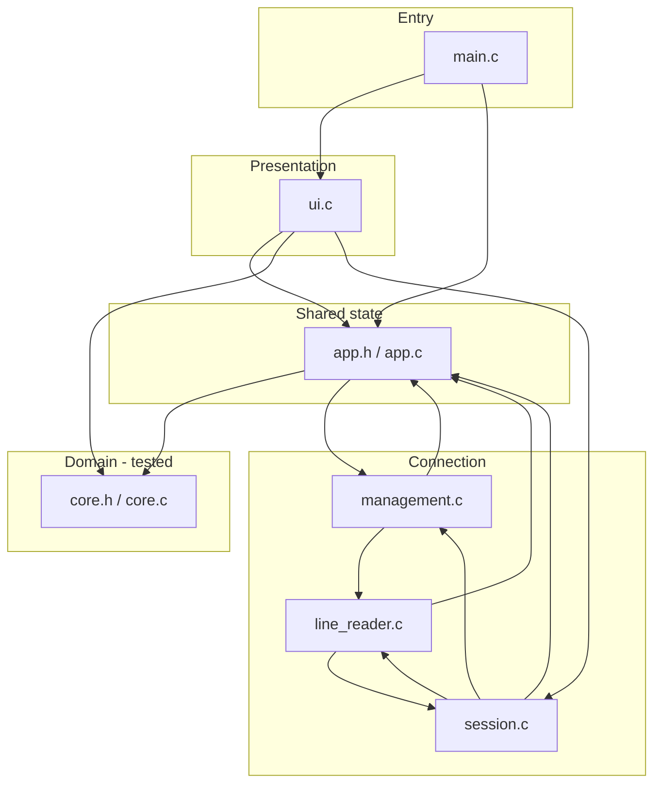
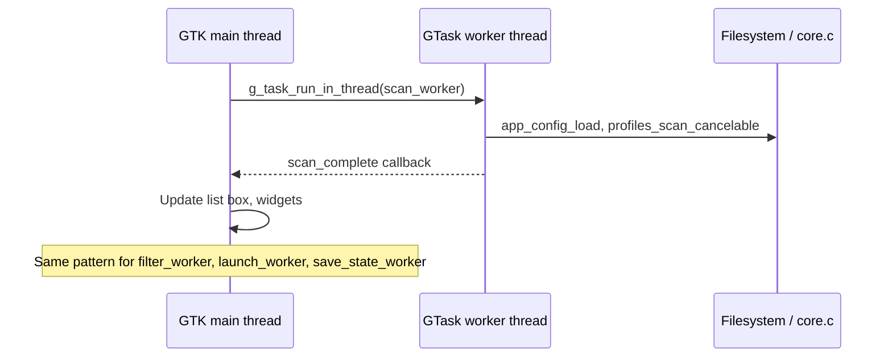
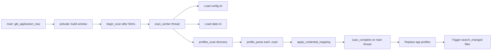
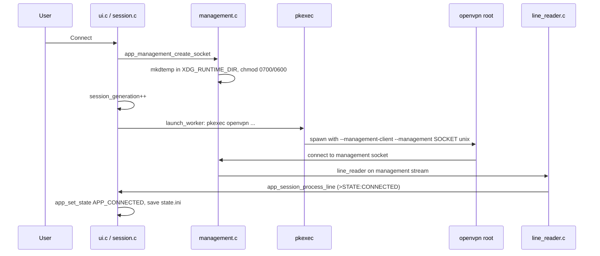
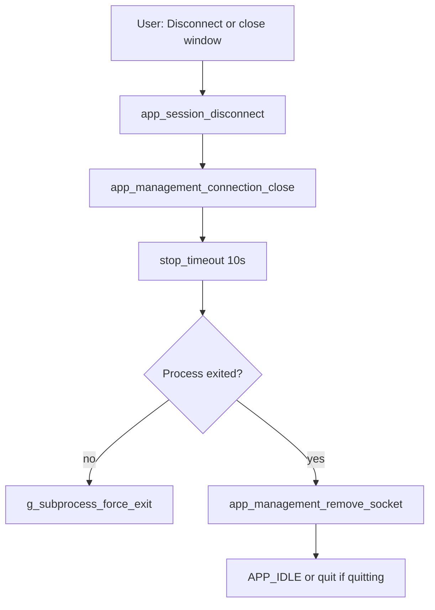

# OpenVPN Manager — Architecture

This document explains how the application is structured, how control and data flow
through it, and where to look when maintaining or extending the code. It is written
for developers who are comfortable reading code but may be new to **C**, **Linux
desktop conventions**, or **GTK**.

For product goals and security rationale, see also
[2026-07-23-native-c-openvpn-manager-design.md](plans/2026-07-23-native-c-openvpn-manager-design.md).

---

## What the application does

OpenVPN Manager is a single-process **GTK 3 desktop application** that:

1. Scans a directory of `.ovpn` profile files (default: `/etc/openvpn/ovpn_udp`).
2. Parses each profile and maps it to a **credential rule** (shared username/password file).
3. Lets the user search and select a profile from a list (up to 100 visible matches).
4. On **Connect**, runs the system OpenVPN binary via **`pkexec`** (PolicyKit prompt).
5. Talks to OpenVPN through a **private Unix management socket** for state updates.
6. On **Disconnect**, closes that socket so OpenVPN exits (`--management-client` mode).

The GUI never blocks the GTK main loop on disk I/O, profile parsing, or process pipes.
Heavy work runs in **GLib worker threads**; UI updates happen on the **main thread**
only.

---

## External libraries and platform services

The code sits on a small stack of well-documented Linux/GNOME components:

| Layer | Used for | Documentation |
|-------|----------|---------------|
| **GTK 3** | Windows, list box, search entry, buttons, labels | [GTK 3 reference](https://docs.gtk.org/gtk3/) |
| **GLib** | Strings, arrays, regex, key-file config, main loop, threads | [GLib reference](https://docs.gtk.org/glib/) |
| **GIO** | Files, directories, subprocesses, sockets, async I/O, `GTask` | [GIO reference](https://docs.gtk.org/gio/) |
| **OpenVPN** | VPN tunnel (external process) | [OpenVPN manual](https://openvpn.net/community-resources/reference-manual-for-openvpn-2-6/) |
| **OpenVPN management interface** | `>STATE:` events, connection lifecycle | [Management interface](https://openvpn.net/community-resources/management-interface/) |
| **PolicyKit / pkexec** | One-shot root authorization to run OpenVPN | [pkexec(1)](https://www.freedesktop.org/software/polkit/docs/latest/pkexec.1.html) |
| **XDG Base Directory** | Config dir (`$XDG_CONFIG_HOME`), runtime dir (`$XDG_RUNTIME_DIR`) | [XDG spec](https://specifications.freedesktop.org/basedir-spec/basedir-spec-latest.html) |

Build dependencies on Ubuntu: `build-essential`, `pkg-config`, `libgtk-3-dev`,
`openvpn`, `policykit-1` (see [README.md](../README.md)).

---

## Concepts for non-C / non-GTK developers

### C in this project

- **No classes** — behaviour is grouped in `.c` files; shared state lives in structs
  (`App`, `Profile`, `AppConfig`).
- **Manual memory management** — GLib helpers (`g_strdup`, `g_free`, `g_object_unref`)
  replace `malloc`/`free` for most heap data. Follow existing `*_free` patterns.
- **Headers (`.h`) declare; sources (`.c`) define** — `core.h` and `app.h` are the public
  APIs for their modules.
- **Error handling** — many GLib functions take `GError **`; on failure the caller must
  `g_clear_error()` or propagate. Profile parse errors are stored on `Profile.error`.

### GTK threading rule (critical)

GTK widgets may **only** be touched on the **main thread** (the thread running
`g_application_run`). Worker threads must not call `gtk_*` functions.

This project uses **`GTask`** + `g_task_run_in_thread()` for background work and
completion callbacks that run back on the main thread to update the UI.

### Linux paths and trust

- **Production profiles** must live under `/etc/openvpn/` and be **root-owned** with
  no group/world write permission (`path_is_secure_file()` in `core.c`).
- **Auth files** must additionally be mode `0600` (`path_is_secure_auth_file()`).
- **User config** lives in `~/.config/openvpn-manager/` (`$XDG_CONFIG_HOME`).

OpenVPN `.ovpn` files are treated as **executable configuration** (they can invoke
scripts). The parser rejects dangerous directives rather than passing them through.

---

## Source layout

```
src/
  main.c           Entry point (~20 lines): GtkApplication, run loop, cleanup
  app.h / app.c    Shared App struct, UI helpers, config paths, shutdown
  ui.c             Window, list box, scan/filter workers, GTK callbacks
  session.c        Connect/disconnect, pkexec launch, OpenVPN log handling
  management.c     Private Unix management socket (create/teardown)
  line_reader.h/c  Async line-by-line reads from stdout/stderr/management
  core.h / core.c  Domain logic: config, parse, scan, filter, path security

tests/
  test_core.c      Unit tests for core (no GTK main loop required)

docs/
  architecture.md  This file
  plans/           Original design document
```

### Module dependency graph



---

## Core data structures

Defined primarily in `core.h` and `app.h`.

### `AppConfig` / `CredentialRule` (`core.h`)

Loaded from `~/.config/openvpn-manager/config.ini`:

- **`profile-directory`** — absolute path scanned for `*.ovpn` files.
- **`[credential.<id>]`** sections — each has `hostname-regex` and `auth-file`.
  Rules are evaluated **in file order**; exactly **one** rule must match a profile.

### `Profile` (`core.h`)

One row in the internal profile list:

| Field | Meaning |
|-------|---------|
| `path` | Absolute path to `.ovpn` file |
| `display_name` | Filename shown in UI |
| `hostname` | Host from first `remote` directive |
| `credential_hostname` | Optional CN from `verify-x509-name CN=...` |
| `credential_id` / `auth_file` | Set when mapping succeeds |
| `error` | Parse or mapping failure message; `NULL` if OK |

A profile is **connectable** when `error == NULL` and credential fields are set
(`profile_is_connectable()`).

### `App` (`app.h`)

Single in-memory application instance (stack-allocated in `main.c`):

- **GTK widgets** — window, search entry, list box, status, buttons, spinner.
- **`profiles`** — `GPtrArray` of `Profile*` (owned; freed on shutdown).
- **`state`** — `AppState` enum (`APP_IDLE` … `APP_ERROR`).
- **Session** — `GSubprocess *process`, management socket paths, `session_generation`
  (stale async callbacks compare against this).
- **Scan/filter** — `GCancellable` + generation counters to cancel superseded work.

---

## Threading and async model



| Operation | Where it runs | Cancellation |
|-----------|---------------|--------------|
| Profile directory scan | Worker (`ui.c`) | `app->scan_cancellable` |
| Search filter | Worker (`ui.c`) | `app->filter_cancellable` |
| OpenVPN spawn | Worker (`session.c`) | N/A (short) |
| Save last-connected path | Worker (`app.c`) | N/A |
| Read stdout/stderr/management | Main loop async I/O (`line_reader.c`) | Reader freed on EOF |
| All GTK updates | Main thread only | — |

Search uses a **120 ms debounce** (`g_timeout_add` in `ui.c`) so typing does not
spawn a filter task on every keystroke.

---

## Startup and profile scan



1. **`app_ui_activate()`** (`ui.c`) builds the window immediately so the user sees UI
   before scan finishes.
2. **`begin_scan`** starts a `GTask` with `scan_worker`.
3. Worker calls **`app_config_load`** and **`profiles_scan_cancelable`** (in `core.c`).
4. For each regular `*.ovpn` file, **`profile_parse`** extracts the first `remote`
   hostname and rejects unsafe directives; **`apply_credential_mapping`** attaches
   credential id/auth file or sets `Profile.error`.
5. **`scan_complete`** moves config + profiles into `App`, restores
   `last_connected_path`, and refreshes the filtered list.

Scan caps: **50,000** profiles, **1 MiB** per file, **8192** bytes per line
(see constants in `core.c`).

---

## Search and list display

- In-memory **`GPtrArray`** holds all scanned profiles (sorted by display name).
- **`profiles_filter_cancelable`** (`core.c`) case-folds query and matches against
  display name and hostname.
- At most **`APP_MAX_VISIBLE_RESULTS` (100)** pointers are returned; total match count
  is shown in the status bar when truncated.
- **`promote_default_profile`** (`ui.c`) moves the last-connected profile to the top
  of visible results when it matches the current query.

List rows are **`GtkListBoxRow`** widgets; the `Profile*` is stored with
`g_object_set_data(..., "profile", profile)`.

---

## Connect flow



**Launch command** (argument vector, never a shell — `session.c`):

```text
/usr/bin/pkexec /usr/sbin/openvpn \
  --config <profile> \
  --auth-user-pass <auth-file> \
  --auth-nocache \
  --management-client \
  --management <socket-path> unix \
  --verb 3
```

Only **paths** are passed; passwords stay in the root-owned auth file. The desktop
**PolicyKit** agent shows the authorization dialog for `pkexec`.

**Connection detection** uses either:

- Management `>STATE:...,CONNECTED,...`, or
- Log line containing `Initialization Sequence Completed`

Both paths call **`app_save_last_connected_path()`**, which writes the profile path
to `~/.config/openvpn-manager/state.ini` on a worker thread.

---

## Disconnect and shutdown



With **`--management-client`**, closing the management connection tells OpenVPN to
terminate. The app does **not** send signals to a root PID from the unprivileged process.

On window close while connected, **`quitting`** is set and disconnect runs; when the
process exits, **`g_application_quit`** is called.

---

## Domain module (`core.c`) — maintenance map

| Concern | Functions / area |
|---------|------------------|
| Load `config.ini` | `app_config_load()` |
| Parse `.ovpn` | `profile_parse()`, `trimmed_line()`, `is_rejected_directive()` |
| Credential mapping | `apply_credential_mapping()` (static) |
| Scan directory | `profiles_scan_cancelable()` |
| Search | `profile_matches()`, `profiles_filter_cancelable()` |
| Path trust checks | `path_is_secure_file()`, `path_is_secure_auth_file()` |

**Tests** (`tests/test_core.c`) cover this module only — run with `make test`.
When changing parsing, mapping, or config validation, extend tests there first.

---

## Configuration files

| File | Purpose |
|------|---------|
| `~/.config/openvpn-manager/config.ini` | Profile directory + credential rules ([example](../config.example.ini)) |
| `~/.config/openvpn-manager/state.ini` | Single line: last successfully connected profile path |
| `/etc/openvpn/.../*.ovpn` | VPN profiles (administrator-managed) |
| `/etc/openvpn/credentials/*.auth` | Two-line username/password files (mode 600, root-owned) |

Missing `config.ini` is not an error; defaults apply (`/etc/openvpn/ovpn_udp`, no rules).

---

## Security summary

- Unprivileged GTK process; **one** elevation at connect via **`pkexec`**.
- Profile parser **denylist** for script/plugin/management/daemon directives.
- **Pre-launch path validation** for profile and auth file metadata.
- Management socket under **`$XDG_RUNTIME_DIR`**, mode **0600**, per session.
- Passwords never in argv, logs, or app storage — only in root auth files.

---

## Build and developer workflow

```sh
make              # build openvpn-manager
make test         # build and run test_core (14 tests)
make clean        # remove objects and binaries
make install-user # ~/.local/bin + desktop file
```

Compiler flags come from `pkg-config` for GTK/GIO (`Makefile`). For IDE IntelliSense,
see `.vscode/c_cpp_properties.json` or generate `compile_commands.json` with
[`bear`](https://github.com/rizsotto/Bear) (listed in `.gitignore`).

Project conventions: [AGENTS.md](../AGENTS.md) — C11, `-Wall -Wextra -Wpedantic`, run
tests after core changes.

---

## Where to change common behaviour

| Goal | Start here |
|------|------------|
| New OpenVPN directive support / stricter parsing | `core.c` → `profile_parse`, tests in `test_core.c` |
| Credential matching rules | `core.c` → `apply_credential_mapping`, config format in README |
| UI layout or widgets | `ui.c` → `app_ui_activate`, `profile_row` |
| Search debounce or visible row limit | `ui.c` / `app.h` (`APP_MAX_VISIBLE_RESULTS`) |
| Connect command line | `session.c` → `launch_worker` |
| Management / disconnect behaviour | `management.c`, `session.c` → `app_session_disconnect` |
| Log message → UI status mapping | `session.c` → `app_session_process_line` |
| New background task pattern | Copy `GTask` pattern from `ui.c` (`scan_worker` / `filter_worker`) |

---

## Related documents

- [README.md](../README.md) — user-facing setup and security notes
- [plans/2026-07-23-native-c-openvpn-manager-design.md](plans/2026-07-23-native-c-openvpn-manager-design.md) — original design decisions
- [config.example.ini](../config.example.ini) — configuration template
