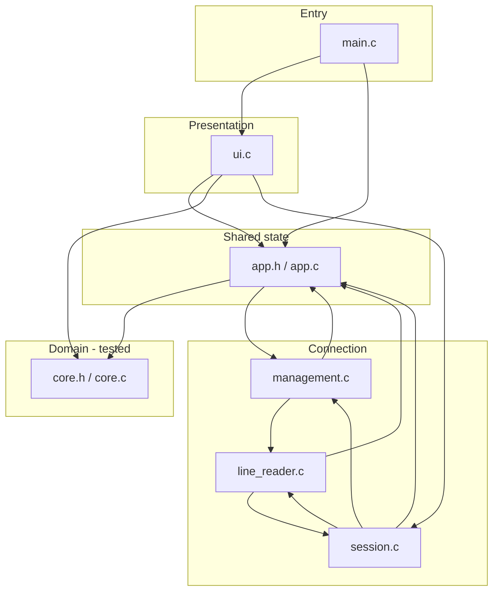
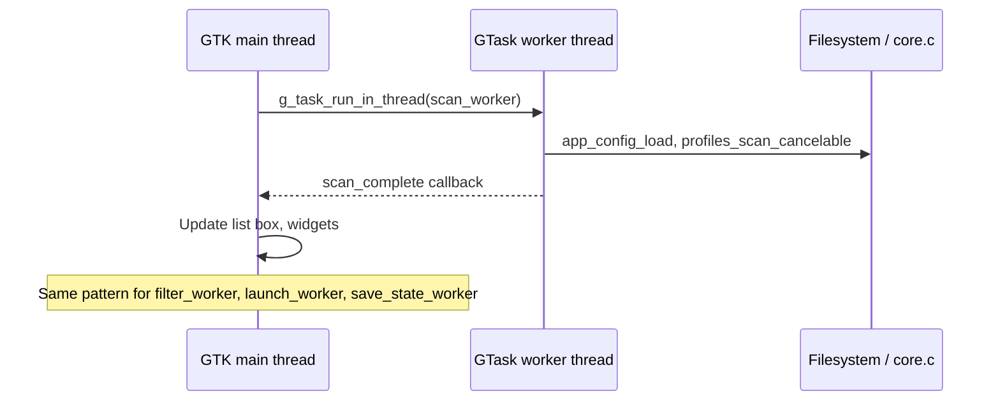
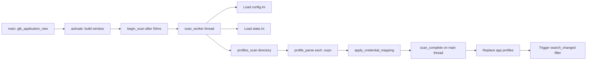
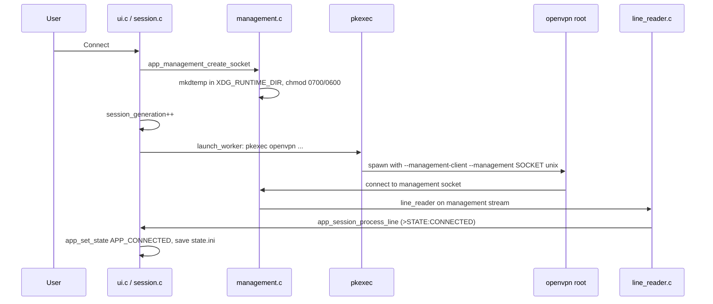
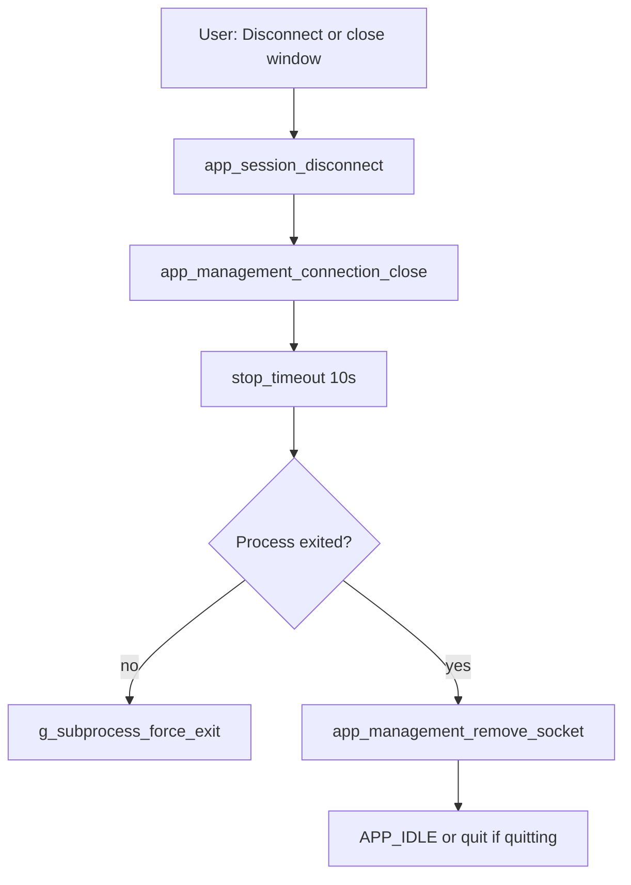

# OpenVPN Manager — Architecture

This document explains how the application is structured, how control and data flow
through it, and where to look when maintaining or extending the code. It is written
for developers who are comfortable reading code but may be new to **C**, **Linux
desktop conventions**, or **GTK**.

For product goals and security rationale, see also
[2026-07-23-native-c-openvpn-manager-design.md](plans/2026-07-23-native-c-openvpn-manager-design.md).

---

## What the application does

OpenVPN Manager is a single-process **GTK 3 desktop application** that:

1. Scans a directory of `.ovpn` profile files (default: `/etc/openvpn/ovpn_udp`).
2. Parses each profile and maps it to a **credential rule** (shared username/password file).
3. Lets the user search and select a profile from a list (up to 100 visible matches).
4. On **Connect**, runs the system OpenVPN binary via **`pkexec`** (PolicyKit prompt).
5. Talks to OpenVPN through a **private Unix management socket** for state updates.
6. On **Disconnect**, closes that socket so OpenVPN exits (`--management-client` mode).

The GUI never blocks the GTK main loop on disk I/O, profile parsing, or process pipes.
Heavy work runs in **GLib worker threads**; UI updates happen on the **main thread**
only.

---

## External libraries and platform services

The code sits on a small stack of well-documented Linux/GNOME components:

| Layer | Used for | Documentation |
|-------|----------|---------------|
| **GTK 3** | Windows, list box, search entry, buttons, labels | [GTK 3 reference](https://docs.gtk.org/gtk3/) |
| **GLib** | Strings, arrays, regex, key-file config, main loop, threads | [GLib reference](https://docs.gtk.org/glib/) |
| **GIO** | Files, directories, subprocesses, sockets, async I/O, `GTask` | [GIO reference](https://docs.gtk.org/gio/) |
| **OpenVPN** | VPN tunnel (external process) | [OpenVPN manual](https://openvpn.net/community-resources/reference-manual-for-openvpn-2-6/) |
| **OpenVPN management interface** | `>STATE:` events, connection lifecycle | [Management interface](https://openvpn.net/community-resources/management-interface/) |
| **PolicyKit / pkexec** | One-shot root authorization to run OpenVPN | [pkexec(1)](https://www.freedesktop.org/software/polkit/docs/latest/pkexec.1.html) |
| **XDG Base Directory** | Config dir (`$XDG_CONFIG_HOME`), runtime dir (`$XDG_RUNTIME_DIR`) | [XDG spec](https://specifications.freedesktop.org/basedir-spec/basedir-spec-latest.html) |

Build dependencies on Ubuntu: `build-essential`, `pkg-config`, `libgtk-3-dev`,
`openvpn`, `policykit-1` (see [README.md](../README.md)).

The sections below explain **what each piece is**, **where it comes from**, and
**trade-offs versus common alternatives**. This project’s choices are deliberate:
a native Linux desktop tool that reuses system VPN and privilege mechanisms rather
than shipping its own tunnel or auth stack.

### GTK 3

**What it is:** The **GIMP Toolkit**, a C library for building graphical user
interfaces — windows, buttons, lists, text fields, menus, and the event loop that
dispatches user input and redraws. This app uses **GTK 3** widgets (`GtkApplication`,
`GtkListBox`, `GtkSearchEntry`, etc.) via `#include <gtk/gtk.h>`.

**Where it comes from:** Maintained by the [GNOME project](https://www.gnome.org/) as
part of the broader GTK/GObject ecosystem. On Ubuntu/Debian it is packaged as
`libgtk-3-dev`; runtime libraries are usually already present on GNOME-based desktops.
Documentation lives at [docs.gtk.org](https://docs.gtk.org/gtk3/).

**Pros (for this project):**

- Native look and behaviour on Linux desktops without bundling a runtime (unlike
  Electron).
- Mature, stable **GTK 3** API — well understood, widely packaged, no bleeding-edge
  migration pressure from GTK 4.
- Integrates naturally with **GLib/GIO** (same object model, main loop, async I/O).
- Lightweight compared to embedding a browser engine; appropriate for a small utility.

**Cons / alternatives:**

| Alternative | Trade-off |
|-------------|-----------|
| **[Qt 6](https://www.qt.io/)** | Excellent cross-platform UI and tooling; heavier dependency, different licensing history (LGPL/commercial), and a separate event loop/model from GLib. Common choice when Windows/macOS matter equally. |
| **[GTK 4 / Libadwaita](https://gtk.org/)** | Modern GNOME stack and styling; API and packaging churn, more opinionated “GNOME app” patterns. Reasonable for new GNOME-only apps; this project stayed on GTK 3 for stability. |
| **[Electron / Tauri + web UI](https://www.electronjs.org/)** | Fast UI iteration if you know web tech; large memory footprint, not “native Linux”, and poor fit for tight integration with `pkexec`, Unix sockets, and system OpenVPN. |
| **No GUI (CLI only)** | Simplest deploy; fails the product goal of search/select for hundreds of profiles. |

### GLib

**What it is:** A low-level **C utility library** from the GNOME stack: dynamic strings
(`GString`, `gchar*`), hash tables, linked lists, **`GPtrArray`**, regular expressions
(`GRegex`), INI/config parsing (`GKeyFile`), the **main event loop**, threads, and
timers. Most “nice to use” C helpers in this codebase (`g_strdup`, `g_strsplit`,
`g_timeout_add`) come from GLib.

**Where it comes from:** [GLib](https://docs.gtk.org/glib/) is maintained alongside GTK
by GNOME. Ubuntu package: `libglib2.0-dev`. GLib is a hard dependency of GTK and GIO.

**Pros:**

- Consistent, battle-tested primitives so the project avoids reinventing string lists,
  config parsing, and regex.
- **Reference counting** and **`GError`** patterns integrate with GIO/GTK.
- **`GMainLoop`** is the hub that drives GTK and async callbacks — one loop for UI,
  socket readiness, and idle handlers.

**Cons / alternatives:**

| Alternative | Trade-off |
|-------------|-----------|
| **ISO C + POSIX only** | Fewer dependencies; you reimplement safe strings, growable arrays, regex, and config formats, or pull in several small libraries anyway. |
| **[Apache APR](https://apr.apache.org/)** | Portable runtime used by Apache httpd; less idiomatic on Linux desktops and no GTK integration. |
| **C++ STL / [Rust std](https://doc.rust-lang.org/std/)** | Richer language ecosystems; this project is **C11** by design for minimal runtime and direct GLib/GTK interop. |
| **[SQLite](https://www.sqlite.org/) for config** | Strong for structured data; overkill for a small INI file and credential rules. `GKeyFile` matches the existing `config.ini` format. |

### GIO

**What it is:** **GLib Input/Output** — higher-level OS services built on GLib: file and
directory access (`GFile`, `GDir`), **subprocess** launch (`GSubprocess`), **Unix domain
sockets** (`GSocketService`), cancellable async work (`GCancellable`, **`GTask`**), and
stream-based async reads/writes. GIO is how the app scans directories in worker threads,
spawns OpenVPN, and reads stdout/stderr without blocking the UI.

**Where it comes from:** Part of GLib ([GIO reference](https://docs.gtk.org/gio/)),
typically linked as `libgio-2.0`. Headers such as `<gio/gio.h>` and
`<gio/gunixsocketaddress.h>` come from the `libglib2.0-dev` / GTK dev packages.

**Pros:**

- **Async-first** API matches GTK’s non-blocking requirement (`g_task_run_in_thread`,
  `g_input_stream_read_async`).
- Cross-platform abstractions (this app targets Linux only, but the APIs are familiar
  to GNOME developers).
- **`GSubprocess`** avoids shell invocation — argv arrays only, which matters for
  security when launching `pkexec` and OpenVPN.

**Cons / alternatives:**

| Alternative | Trade-off |
|-------------|-----------|
| **Raw POSIX** (`fork`/`exec`, `read`, `socket`, `poll`) | Maximum control and minimal abstraction; more boilerplate, easier to get edge cases wrong (EINTR, partial reads, fd leaks). |
| **[libuv](https://libuv.org/)** | Popular async I/O (Node.js backend); second event-loop model alongside GTK’s loop — awkward to combine. |
| **Boost.Asio / standalone Asio** | Strong C++ networking; not applicable to this C codebase. |
| **Synchronous `stdio` in GTK callbacks** | Simple to write; **freezes the UI** during scan/connect — explicitly rejected in the design. |

### OpenVPN

**What it is:** A widely deployed **open-source VPN daemon** that implements SSL/TLS
tunnels using `.ovpn` profile files. This application does **not** embed VPN logic; it
runs the system binary **`/usr/sbin/openvpn`** as a separate **root** process (via
`pkexec`) and passes profile and auth-file paths as arguments.

**Where it comes from:** [OpenVPN project](https://openvpn.net/community/) (community
edition on Linux distros). Ubuntu package: `openvpn`. Profiles and credentials are
administrator-supplied under `/etc/openvpn/`.

**Pros:**

- **De facto standard** for commercial VPN providers that ship `.ovpn` bundles (e.g.
  NordVPN-style hostname-per-endpoint layouts).
- Mature **management interface** and `--auth-user-pass` file format.
- Reuses the same binary and profiles users may already trust and audit system-wide.

**Cons / alternatives:**

| Alternative | Trade-off |
|-------------|-----------|
| **[WireGuard](https://www.wireguard.com/)** (`wg-quick`, NetworkManager plugin) | Simpler modern crypto and kernel module; different config model (not `.ovpn`), often one peer per interface — poor match for hundreds of provider `.ovpn` files. |
| **[OpenConnect](https://www.infradead.org/openconnect/)** | Good for Cisco AnyConnect-style servers; different protocol and profile format. |
| **NetworkManager VPN plugins** | Integrated desktop UX; adds NM dependency and abstraction — explicitly out of scope for this “direct OpenVPN process” tool. |
| **Proprietary vendor GUIs** | Turnkey for one provider; not a general manager for a directory of profiles. |

### OpenVPN management interface

**What it is:** A **text protocol** on a TCP or Unix socket where OpenVPN emits lines
such as `>STATE:...,CONNECTED,...` and accepts commands like `state on`. With
**`--management-client`**, OpenVPN connects **to** a socket owned by the GUI; when that
socket closes, OpenVPN is documented to **exit** — which is how Disconnect works without
signalling a root PID from an unprivileged app.

**Where it comes from:** Built into OpenVPN; documented in the
[management interface notes](https://openvpn.net/community-resources/management-interface/).
This app creates a listener under `$XDG_RUNTIME_DIR` and passes the path with
`--management <path> unix`.

**Pros:**

- Structured **connection state** without parsing all of stdout.
- Clean **lifecycle coupling** for `--management-client` shutdown.
- Well-known among OpenVPN automation (scripts, monitoring tools).

**Cons / alternatives:**

| Alternative | Trade-off |
|-------------|-----------|
| **Parse stdout/stderr only** | Works for “connected” heuristics (this app still watches log lines as a fallback); no reliable state machine, harder disconnect semantics. |
| **D-Bus via NetworkManager** | Rich integration on NM-managed systems; not available for a standalone `pkexec openvpn` session. |
| **Custom helper daemon** | Could expose a stable IPC API; more moving parts, install footprint, and security review — rejected in favour of OpenVPN’s built-in interface. |

### PolicyKit and pkexec

**What it is:** **PolicyKit (polkit)** is a framework for defining **who may perform
privileged actions** on a Linux system. **`pkexec`** is a small helper that runs one
command as root after the desktop **polkit agent** shows an authorization dialog (unless
policy allows caching). Connect uses:

```text
pkexec /usr/sbin/openvpn ...
```

**Where it comes from:** [freedesktop.org](https://www.freedesktop.org/wiki/Software/polkit/)
stack; Ubuntu packages `policykit-1` and a desktop agent (e.g. GNOME’s polkit dialog).
No custom sudoers entry or setuid binary is installed by this app.

**Pros:**

- **Standard desktop pattern** for occasional root actions — familiar to users and
  distros.
- **No persistent setuid helper** or broad sudoers rule shipped with the app.
- Authorization policy can be refined by administrators via polkit rules (outside
  this repo).

**Cons / alternatives:**

| Alternative | Trade-off |
|-------------|-----------|
| **`sudo` + `/etc/sudoers.d`** | Simple for admins; easy to grant **too much** privilege; not a graphical consent flow by default; app would depend on site-specific sudo policy. |
| **Custom setuid helper** | Full control over the API; high security maintenance burden (argument validation, privilege separation, updates). |
| **Run entire GUI as root** | Avoids elevation at connect time; unacceptable attack surface for a tool that parses files and renders untrusted strings. |
| **Capabilities (`cap_net_admin`)** without full root | Possible for some tunnel setups; OpenVPN’s traditional model and `pkexec` path expect root for routing/TUN — not pursued here. |

**Note:** Whether `pkexec` prompts every time or caches approval is **session/policy
dependent**; the app does not control that.

### XDG Base Directory specification

**What it is:** A **freedesktop convention** for where user-specific files live:

- **`$XDG_CONFIG_HOME`** (default `~/.config`) — config, e.g.
  `~/.config/openvpn-manager/config.ini`
- **`$XDG_RUNTIME_DIR`** (default `/run/user/<uid>`) — session-private dir for runtime
  files, used for the per-session management socket directory

Accessed via GLib: `g_get_user_config_dir()`, `g_get_user_runtime_dir()`.

**Where it comes from:** [XDG Base Directory Specification](https://specifications.freedesktop.org/basedir-spec/basedir-spec-latest.html)
(freedesktop.org). Implemented by GLib and respected by most Linux desktop software.

**Pros:**

- Predictable paths across distributions; respects user overrides (e.g. relocated home).
- **`XDG_RUNTIME_DIR`** is tmpfs, user-owned, and suited to short-lived socket paths.
- Avoids cluttering `$HOME` with dot-directories ad hoc.

**Cons / alternatives:**

| Alternative | Trade-off |
|-------------|-----------|
| **Hardcoded `~/.openvpn-manager`** | Simple; ignores XDG and user `XDG_CONFIG_HOME`. |
| **Windows `%APPDATA%` / macOS `Application Support`** | Required for cross-platform ports; irrelevant to this Ubuntu-focused build. |
| **System-wide config in `/etc` only** | Fine for admin defaults; poor for per-user credential rules and last-connected state without multi-user conflicts. |

---

## Concepts for non-C / non-GTK developers

### C in this project

- **No classes** — behaviour is grouped in `.c` files; shared state lives in structs
  (`App`, `Profile`, `AppConfig`).
- **Manual memory management** — GLib helpers (`g_strdup`, `g_free`, `g_object_unref`)
  replace `malloc`/`free` for most heap data. Follow existing `*_free` patterns.
- **Headers (`.h`) declare; sources (`.c`) define** — `core.h` and `app.h` are the public
  APIs for their modules.
- **Error handling** — many GLib functions take `GError **`; on failure the caller must
  `g_clear_error()` or propagate. Profile parse errors are stored on `Profile.error`.

### GTK threading rule (critical)

GTK widgets may **only** be touched on the **main thread** (the thread running
`g_application_run`). Worker threads must not call `gtk_*` functions.

This project uses **`GTask`** + `g_task_run_in_thread()` for background work and
completion callbacks that run back on the main thread to update the UI.

### Linux paths and trust

- **Production profiles** must live under `/etc/openvpn/` and be **root-owned** with
  no group/world write permission (`path_is_secure_file()` in `core.c`).
- **Auth files** must additionally be mode `0600` (`path_is_secure_auth_file()`).
- **User config** lives in `~/.config/openvpn-manager/` (`$XDG_CONFIG_HOME`).

OpenVPN `.ovpn` files are treated as **executable configuration** (they can invoke
scripts). The parser rejects dangerous directives rather than passing them through.

---

## Source layout

```
src/
  main.c           Entry point (~20 lines): GtkApplication, run loop, cleanup
  app.h / app.c    Shared App struct, UI helpers, config paths, shutdown
  ui.c             Window, list box, scan/filter workers, GTK callbacks
  session.c        Connect/disconnect, pkexec launch, OpenVPN log handling
  management.c     Private Unix management socket (create/teardown)
  line_reader.h/c  Async line-by-line reads from stdout/stderr/management
  core.h / core.c  Domain logic: config, parse, scan, filter, path security

tests/
  test_core.c      Unit tests for core (no GTK main loop required)

docs/
  architecture.md  This file
  plans/           Original design document
```

### Module dependency graph



---

## Core data structures

Defined primarily in `core.h` and `app.h`.

### `AppConfig` / `CredentialRule` (`core.h`)

Loaded from `~/.config/openvpn-manager/config.ini`:

- **`profile-directory`** — absolute path scanned for `*.ovpn` files.
- **`[credential.<id>]`** sections — each has `hostname-regex` and `auth-file`.
  Rules are evaluated **in file order**; exactly **one** rule must match a profile.

### `Profile` (`core.h`)

One row in the internal profile list:

| Field | Meaning |
|-------|---------|
| `path` | Absolute path to `.ovpn` file |
| `display_name` | Filename shown in UI |
| `hostname` | Host from first `remote` directive |
| `credential_hostname` | Optional CN from `verify-x509-name CN=...` |
| `credential_id` / `auth_file` | Set when mapping succeeds |
| `error` | Parse or mapping failure message; `NULL` if OK |

A profile is **connectable** when `error == NULL` and credential fields are set
(`profile_is_connectable()`).

### `App` (`app.h`)

Single in-memory application instance (stack-allocated in `main.c`):

- **GTK widgets** — window, search entry, list box, status, buttons, spinner.
- **`profiles`** — `GPtrArray` of `Profile*` (owned; freed on shutdown).
- **`state`** — `AppState` enum (`APP_IDLE` … `APP_ERROR`).
- **Session** — `GSubprocess *process`, management socket paths, `session_generation`
  (stale async callbacks compare against this).
- **Scan/filter** — `GCancellable` + generation counters to cancel superseded work.

---

## Threading and async model



| Operation | Where it runs | Cancellation |
|-----------|---------------|--------------|
| Profile directory scan | Worker (`ui.c`) | `app->scan_cancellable` |
| Search filter | Worker (`ui.c`) | `app->filter_cancellable` |
| OpenVPN spawn | Worker (`session.c`) | N/A (short) |
| Save last-connected path | Worker (`app.c`) | N/A |
| Read stdout/stderr/management | Main loop async I/O (`line_reader.c`) | Reader freed on EOF |
| All GTK updates | Main thread only | — |

Search uses a **120 ms debounce** (`g_timeout_add` in `ui.c`) so typing does not
spawn a filter task on every keystroke.

---

## Startup and profile scan



1. **`app_ui_activate()`** (`ui.c`) builds the window immediately so the user sees UI
   before scan finishes.
2. **`begin_scan`** starts a `GTask` with `scan_worker`.
3. Worker calls **`app_config_load`** and **`profiles_scan_cancelable`** (in `core.c`).
4. For each regular `*.ovpn` file, **`profile_parse`** extracts the first `remote`
   hostname and rejects unsafe directives; **`apply_credential_mapping`** attaches
   credential id/auth file or sets `Profile.error`.
5. **`scan_complete`** moves config + profiles into `App`, restores
   `last_connected_path`, and refreshes the filtered list.

Scan caps: **50,000** profiles, **1 MiB** per file, **8192** bytes per line
(see constants in `core.c`).

---

## Search and list display

- In-memory **`GPtrArray`** holds all scanned profiles (sorted by display name).
- **`profiles_filter_cancelable`** (`core.c`) case-folds query and matches against
  display name and hostname.
- At most **`APP_MAX_VISIBLE_RESULTS` (100)** pointers are returned; total match count
  is shown in the status bar when truncated.
- **`promote_default_profile`** (`ui.c`) moves the last-connected profile to the top
  of visible results when it matches the current query.

List rows are **`GtkListBoxRow`** widgets; the `Profile*` is stored with
`g_object_set_data(..., "profile", profile)`.

---

## Connect flow



**Launch command** (argument vector, never a shell — `session.c`):

```text
/usr/bin/pkexec /usr/sbin/openvpn \
  --config <profile> \
  --auth-user-pass <auth-file> \
  --auth-nocache \
  --management-client \
  --management <socket-path> unix \
  --verb 3
```

Only **paths** are passed; passwords stay in the root-owned auth file. The desktop
**PolicyKit** agent shows the authorization dialog for `pkexec`.

**Connection detection** uses either:

- Management `>STATE:...,CONNECTED,...`, or
- Log line containing `Initialization Sequence Completed`

Both paths call **`app_save_last_connected_path()`**, which writes the profile path
to `~/.config/openvpn-manager/state.ini` on a worker thread.

---

## Disconnect and shutdown



With **`--management-client`**, closing the management connection tells OpenVPN to
terminate. The app does **not** send signals to a root PID from the unprivileged process.

On window close while connected, **`quitting`** is set and disconnect runs; when the
process exits, **`g_application_quit`** is called.

---

## Domain module (`core.c`) — maintenance map

| Concern | Functions / area |
|---------|------------------|
| Load `config.ini` | `app_config_load()` |
| Parse `.ovpn` | `profile_parse()`, `trimmed_line()`, `is_rejected_directive()` |
| Credential mapping | `apply_credential_mapping()` (static) |
| Scan directory | `profiles_scan_cancelable()` |
| Search | `profile_matches()`, `profiles_filter_cancelable()` |
| Path trust checks | `path_is_secure_file()`, `path_is_secure_auth_file()` |

**Tests** (`tests/test_core.c`) cover this module only — run with `make test`.
When changing parsing, mapping, or config validation, extend tests there first.

---

## Configuration files

| File | Purpose |
|------|---------|
| `~/.config/openvpn-manager/config.ini` | Profile directory + credential rules ([example](../config.example.ini)) |
| `~/.config/openvpn-manager/state.ini` | Single line: last successfully connected profile path |
| `/etc/openvpn/.../*.ovpn` | VPN profiles (administrator-managed) |
| `/etc/openvpn/credentials/*.auth` | Two-line username/password files (mode 600, root-owned) |

Missing `config.ini` is not an error; defaults apply (`/etc/openvpn/ovpn_udp`, no rules).

---

## Security summary

- Unprivileged GTK process; **one** elevation at connect via **`pkexec`**.
- Profile parser **denylist** for script/plugin/management/daemon directives.
- **Pre-launch path validation** for profile and auth file metadata.
- Management socket under **`$XDG_RUNTIME_DIR`**, mode **0600**, per session.
- Passwords never in argv, logs, or app storage — only in root auth files.

---

## Build and developer workflow

```sh
make              # build openvpn-manager
make test         # build and run test_core (14 tests)
make clean        # remove objects and binaries
make install-user # ~/.local/bin + desktop file
```

Compiler flags come from `pkg-config` for GTK/GIO (`Makefile`). For IDE IntelliSense,
see `.vscode/c_cpp_properties.json` or generate `compile_commands.json` with
[`bear`](https://github.com/rizsotto/Bear) (listed in `.gitignore`).

Project conventions: [AGENTS.md](../AGENTS.md) — C11, `-Wall -Wextra -Wpedantic`, run
tests after core changes.

---

## Where to change common behaviour

| Goal | Start here |
|------|------------|
| New OpenVPN directive support / stricter parsing | `core.c` → `profile_parse`, tests in `test_core.c` |
| Credential matching rules | `core.c` → `apply_credential_mapping`, config format in README |
| UI layout or widgets | `ui.c` → `app_ui_activate`, `profile_row` |
| Search debounce or visible row limit | `ui.c` / `app.h` (`APP_MAX_VISIBLE_RESULTS`) |
| Connect command line | `session.c` → `launch_worker` |
| Management / disconnect behaviour | `management.c`, `session.c` → `app_session_disconnect` |
| Log message → UI status mapping | `session.c` → `app_session_process_line` |
| New background task pattern | Copy `GTask` pattern from `ui.c` (`scan_worker` / `filter_worker`) |

---

## Related documents

- [README.md](../README.md) — user-facing setup and security notes
- [plans/2026-07-23-native-c-openvpn-manager-design.md](plans/2026-07-23-native-c-openvpn-manager-design.md) — original design decisions
- [config.example.ini](../config.example.ini) — configuration template
